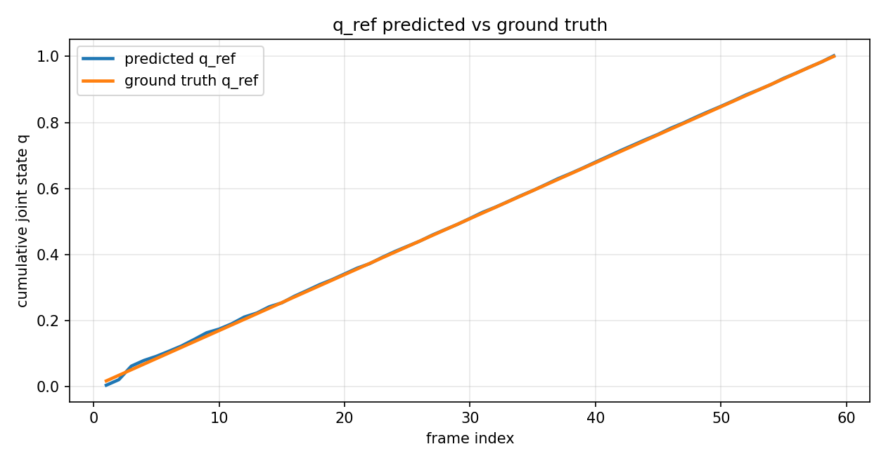
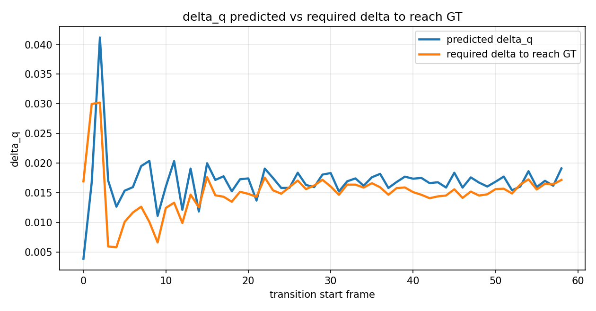
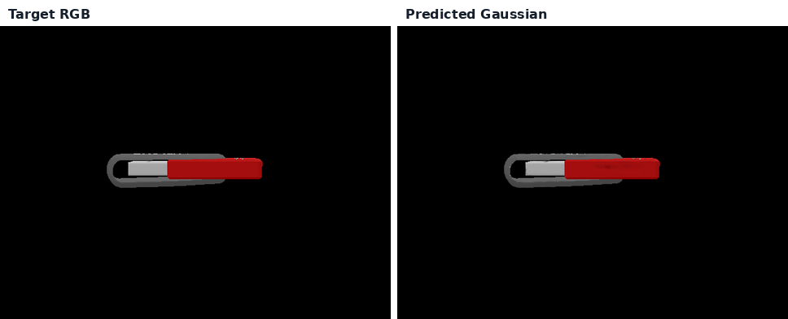

# SAMArtGS Delta-Q Tracking

Articulated motion tracking for 3D Gaussian Splatting by optimizing only the joint displacement `delta_q`.

This repository builds on the official GraphDECO 3D Gaussian Splatting codebase and adds a cleaned pipeline for tracking articulated object motion from RGB observations. The final pipeline estimates the frame-to-frame joint displacement while keeping the Gaussian representation, camera, joint metadata, and part segmentation frozen.

## What This Repository Adds

The main contribution is a delta-q tracking pipeline for articulated 3D Gaussian Splatting.

For each transition `t -> t+1`, the method:

1. starts from the Gaussian model at frame `t`;
2. loads the target RGB/mask/camera at frame `t+1`;
3. keeps all Gaussian parameters frozen;
4. keeps the camera frozen;
5. keeps joint type, axis, pivot/origin, and part IDs frozen;
6. initializes `delta_q = 0`;
7. optimizes only `delta_q`;
8. applies the articulated transform only to the moving-part Gaussians;
9. renders the predicted Gaussian frame at `t+1`;
10. compares the render with the target observation;
11. commits the best-loss `delta_q`;
12. updates the accumulated joint state:

```text
q_ref(t+1) = q_ref(t) + delta_q
```

## Method Summary

The optimization variable is only:

```text
delta_q
```

Frozen during optimization:

* Gaussian positions
* Gaussian colors/features
* opacity
* scale
* rotation
* camera parameters
* joint type
* joint axis
* joint pivot/origin
* part IDs

The final tracker is therefore a low-dimensional articulated motion estimator built on top of a frozen 3D Gaussian scene representation.

## Repository Structure

```text
scripts/delta_q_tracking/
├── __init__.py
├── archive/
├── articulation.py
├── config_usb.yaml
├── deformed_gaussian.py
├── io_utils.py
├── losses.py
├── reporting/
│   ├── __init__.py
│   ├── create_readme_assets.py
│   ├── make_html_report.py
│   └── plot_tracking_diagnostics.py
└── run_sequence.py
```

Main files:

| File | Purpose |
| --- | --- |
| `run_sequence.py` | Runs the final frame-to-frame delta-q tracking sequence. |
| `articulation.py` | Builds articulated joint transforms from joint metadata. |
| `deformed_gaussian.py` | Applies the joint transform only to moving-part Gaussians. |
| `io_utils.py` | Loads Gaussian models, cameras, RGB/mask data, metadata, and sequence files. |
| `losses.py` | Defines the masked RGB/SSIM image objective. |
| `reporting/plot_tracking_diagnostics.py` | Generates tracking plots and diagnostics. |
| `reporting/make_html_report.py` | Builds the final HTML report. |
| `reporting/create_readme_assets.py` | Creates lightweight README visual assets. |
| `archive/` | Legacy diagnostics and old experimental scripts kept for reproducibility, not part of the final runtime pipeline. |

## Final Pipeline Configuration

The final cleaned pipeline uses:

```yaml
model_path: ../dataset/usb_gauss_new
gaussian_source: scene_mask_filtered_renderer
rotation_mode: rigid
use_best_loss_delta_q: true
```

Additional assumptions:

* no image-space shift;
* no manual alignment correction;
* best-loss restore enabled;
* early stopping enabled;
* temporal delta regularization enabled;
* only `delta_q` optimized.

## Usage

Run the final tracking sequence:

```bash
python scripts/delta_q_tracking/run_sequence.py \
  --config scripts/delta_q_tracking/config_usb.yaml \
  --cam 0 \
  --start-frame 0 \
  --end-frame 59 \
  --output-subdir final_rigid_usb_gauss_new
```

Generate plots:

```bash
python scripts/delta_q_tracking/reporting/plot_tracking_diagnostics.py \
  --sequence-dir outputs/delta_q_tracking/usb/final_rigid_usb_gauss_new/cam_000
```

Generate the HTML report:

```bash
python scripts/delta_q_tracking/reporting/make_html_report.py
```

## Outputs

A run produces:

```text
outputs/delta_q_tracking/usb/<run_name>/cam_000/
├── trajectory.json
├── trajectory.csv
├── optimization_iterations.json
├── optimization_iterations.csv
├── plots/
└── renders / overlays / diagnostics
```

The HTML report is generated under:

```text
outputs/delta_q_tracking/usb/report/index.html
```

Generated outputs are not committed to this repository.

## Example Results

### Cumulative Joint Tracking



This plot compares the accumulated predicted joint state `q_ref` with the ground-truth joint trajectory.

### Delta-Q Tracking



The required delta is defined as:

```text
required_delta_to_GT = q_gt(t+1) - q_ref(t)
```

This quantity is useful because the optimizer starts from the accumulated predicted state `q_ref(t)`, not from the ground-truth state `q_gt(t)`.

### Target RGB vs Predicted Gaussian



Left: target RGB frame.
Right: predicted Gaussian render after optimizing only `delta_q`.

[MP4 version](docs/assets/readme/rgb_vs_predicted_gauss.mp4)

## Evaluation Metrics

The main tracking metrics are:

* `q_ref` predicted vs ground truth;
* `q_ref` error;
* predicted `delta_q` vs GT increment;
* predicted `delta_q` vs `required_delta_to_GT`;
* support IoU;
* worst-frame/outlier analysis;
* iterations per frame.

The optimization objective/loss is an internal fitting objective. It is not the final tracking metric.

## Data and Artifacts

Datasets, trained Gaussian models, rendered outputs, and large artifacts are not included in this repository.

Ignored paths include:

```text
dataset/
outputs/
tmp_render_source/
```

Large files such as `.ply`, `.pt`, `.pth`, `.ckpt`, `.mp4`, `.npy`, and `.npz` are ignored by default, except for lightweight README assets under:

```text
docs/assets/readme/
```

## Attribution

This repository is built on top of the official GraphDECO/Inria implementation of 3D Gaussian Splatting.

Original repository:

```text
https://github.com/graphdeco-inria/gaussian-splatting
```

Original README preserved in:

```text
README_3DGS_ORIGINAL.md
```

Please cite the original 3D Gaussian Splatting paper when using the base renderer/code:

```bibtex
@Article{kerbl3Dgaussians,
  author       = {Kerbl, Bernhard and Kopanas, Georgios and Leimkühler, Thomas and Drettakis, George},
  title        = {3D Gaussian Splatting for Real-Time Radiance Field Rendering},
  journal      = {ACM Transactions on Graphics},
  number       = {4},
  volume       = {42},
  month        = {July},
  year         = {2023},
  url          = {https://repo-sam.inria.fr/fungraph/3d-gaussian-splatting/}
}
```

## License

The original GraphDECO license is preserved in `LICENSE.md`.

This repository inherits the licensing constraints of the original GraphDECO 3D Gaussian Splatting codebase.
